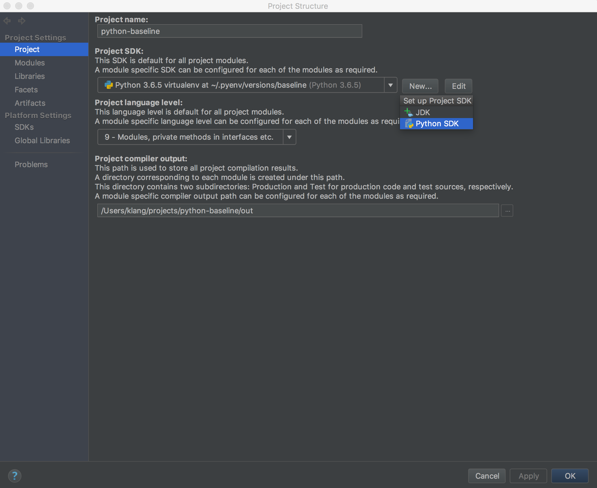
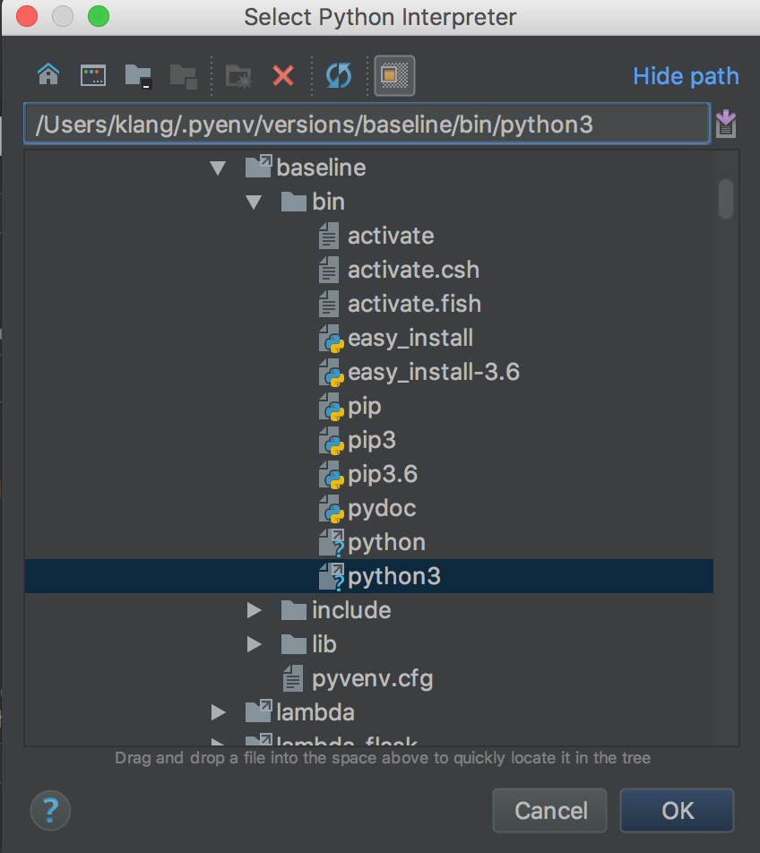
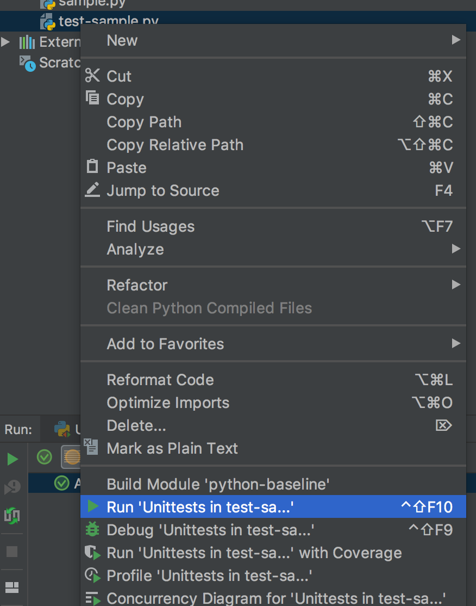
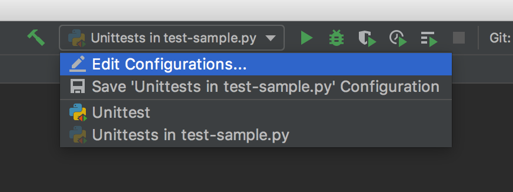
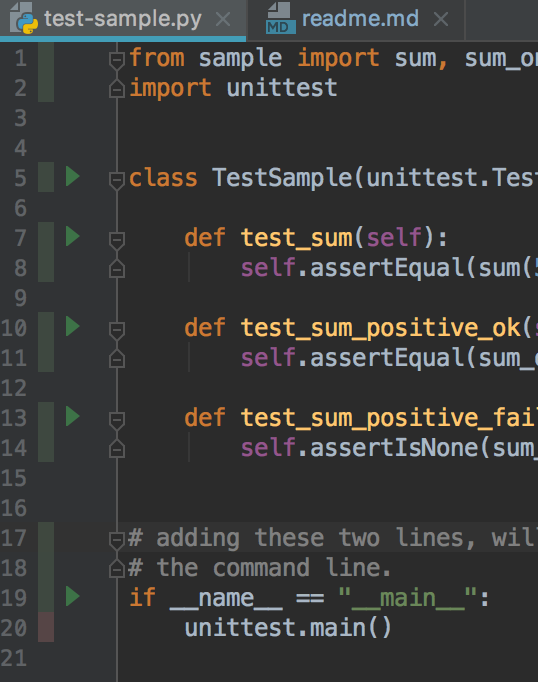

# Python3

## virtual environment using `virtualenv` on mac

    brew install python3
    pip3 install --upgrade pip setuptools
    pip3 install virtualenv

    virtualenv -p $(which python3) venv
    source venv/bin/activate

## virtual environment using `venv` on mac

https://medium.com/@henriquebastos/the-definitive-guide-to-setup-my-python-workspace-628d68552e14

    brew install pyenv
    brew install pyenv-virtualenv
    brew install pyenv-virtualenvwrapper
    pyenv install 3.6.5
    
    pyenv virtualenv 3.6.5 baseline
    pyenv activate baseline
    pyenv global 3.6.0 baseline
    pyenv deactivate
    
    
    pyenv virtualenv 3.6.5 baseline-flask
    pyenv activate baseline-flask
    export PYENV_VIRTUALENV_DISABLE_PROMPT=1
    pip install Flask
    FLASK_ENV=development FLASK_APP=mock-url-signer.py flask run
    

## virtual environment using `pipenv` on mac

https://www.youtube.com/watch?v=GBQAKldqgZs

# IntelliJ environment

"File" -> "Project Structure..." -> "Project"

Under Project SDK, "New"

Write the path to the environment you want

    /Users/klang/.pyenv/versions/baseline/bin/python3
    
    
If an `requirements.txt` file is present, IntelliJ will install the requirements in the environment selected.

# Code Coverage

https://stackoverflow.com/questions/36517137/how-to-properly-use-coverage-py-in-python

    (baseline) iam[klang@bascule python-baseline]$ coverage run test-sample.py
    ...
    ----------------------------------------------------------------------
    Ran 3 tests in 0.000s
    
    OK
    (baseline) iam[klang@bascule python-baseline]$ coverage report -m
    Name             Stmts   Miss  Cover   Missing
    ----------------------------------------------
    sample.py            6      0   100%
    test-sample.py      11      0   100%
    ----------------------------------------------
    TOTAL               17      0   100%

The coverage reported by IntelliJ may be a bit different.

## IntelliJ run configuration

First, we need to trick IntelliJ into making a Run Configuration for us:

We can save this configuration for future use:

Now we can run the unittests with Coverage:

    
IntelliJ will pop up a window telling the coverage of each file:

Of course, 100% coverage isn't really possible, when we have selected to be able to run this specific file from the command line as well. That means, that the coverage percentage has to be taken with a grain of salt.

All this was inspired by this [blog post](https://blog.jetbrains.com/pycharm/2015/06/feature-spotlight-python-code-coverage-with-pycharm/) and adapted to the latest version of IntelliJ.

   
## frontend

An example frontend is represented in `baseline-flask` and can be started with

    pyenv activate baseline-flask
    flask --app=frontend dev -p 5000
    # flask complains when --configfile is used, unless we make a softlink to the configfile
    ln -s ../frontend.default_settings frontend/frontend.default_settings
    ln -s ../frontend.swagger_settings frontend/frontend.swagger_settings
    ln -s ../frontend.develop_settings frontend/frontend.develop_settings
    flask --app=frontend --configfile=frontend.default_settings  dev -p 5000

The `frontend.develop_settings` file is NOT part of the repository right now. 

## build

    pip install --upgrade pip
    pip install --upgrade setuptools wheel
    python3 setup.py sdist bdist_wheel

### usage

    pyenv virtualenv 3.6.5 netmanager-deployment
    echo "netmanager-deployment" > .python-version
    pip install netmanager-web-0.0.1.tar.gz
    # ensure that netmanager_web/settins* and runlocal.py are available

    python runlocal.py

